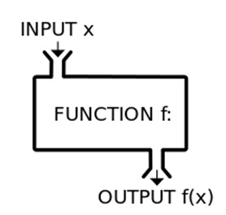

### Introduction to R functions




```{r,  warning=FALSE, message=FALSE}
library(tidyverse)
library(ggthemes)
```

### Introduction

Writing functions is a fundamental component of programming and therefore scares many people. However! Functions can be easier than you'd think. For example, think of what *your* perfect bar plot looks like. How much time do you spend making your bar plots look like that? Wouldn't it be great if the very first time you plotted a barplot it looked exactly the way you wanted it to? With functions you can do that, and all the knowledge you'd need is how to make the barplot look the way you want. This works shop gives a quick overview of how to use functions to make your life easier. Demonstrations will be done in R, but are applicable to most languages. 

One of the more powerful aspects of programming languages relative GUI statistical softwares is the ability to create functions. Functions are extremely powerful because they allow for the automation of repetitive tasks and reduce bloated code from the more traditional "copy-paste" format. This becomes extremely powerful when combined with the apply family or loops. However, even for simple tasks, functions can make your life easier. 

Why use functions?

* save complicated operations or mathematical calculations
* reduce repetitive tasks
* standardize formats (e.g. plots, maps, etc)
* combine with apply family for automation of tasks

### Function Syntax

The format of function is fairly simple:

`function.name <- function(arguments){`
`arguments + operation`
`}`

Here arguments can be any lists of text or characters that will later be used within the formula. Within the function, the operate will have two general components. Firstly, the portion of the function that will remain unchanged each time it is used. The second are the arguments that will be changed each time. 

```{r}
## Write the first function
plus1 <- function(x){
x+1 ## the arugment and operation
}
plus1(x=5)
```

For these functions there are two items that will remain unchanged. The first is the calculation. In the above example, the addition operation will not change and remains the same. These types of functions are useful when you have a particular index that you are trying to calculate, but the inputs will keep changing. 

For instance say you want to convert degrees to radians. The function you would write would be this. 

```{r}
deg2rad <- function(deg) {
  (deg * pi) / (180)
}

deg2rad(90)

## For simpler functions you can write them as one line
deg2rad <- function(deg) {(deg * pi) / (180)} 

```

Log response ratio is a calculation when comparing two groups based on a treatment vs control format. 

```{r}
LRR <- function(treatment,control){
  log(treatment/control)
}
LRR(treatment=30, control=20)
```

Here we see that the log response ratio of our two individuals. Specifying the treatments is not entirely necessary. Depending on how you set up your arguments, R will assume your inputs will be in the order that they are presented. The function can also handle any type of data format such as number, vector, shapefile, dataframe, etc, just as long as what is specified within the function can handle it.


```{r}
treat1 = c(30,40,50,35,45,55)
control1= c(20,25,30,23,25,20)
LRR(treat1, control1)
```


You can also utilize functions alreay present within R. 

```{r}
## Create function to calculate average
average <- function(x){
  sum(x)/length(x) 
}

## assign LRR to object
results <- LRR(treat1, control1)
## calculate the average of results from LRR
average(results)
```

There is no standard error function present in base R, so this simple formula below is probably one that I use the most. 
```{r}
se <- function(x){ sd(x)/sqrt(length(x)) } ## sd/sqrt(n)
```

### Functions for plots

Creating plots requires a lot of ajustments. The aesthetic component is getting better and packages such as ggplot2 help format plots to be more appealing. However, defaults are not ideal and often not publication quality. It can be helpful to create a function that matches your ideal plot archetype and then edit the inputs only. 

Lets use the cars dataset to conduct and plot a correlation

```{r}
plot(cars$speed, cars$dist)
```

On default this plot is pretty ugly. Let's try and make it better
```{r}
## Improve the aesthetic of my plot
par(mar = c(4.5, 4.5, 0.5, 0.5))
plot(cars$speed, cars$dist, pch=19, cex.axis=1.3, cex.lab=1.5, frame.plot = F)

## Revise it as a function
myscatter <- function(x, y){
par(mar = c(4.5, 4.5, 0.5, 0.5))
plot(x, y, pch=19, cex.axis=1.3, cex.lab=1.5, frame.plot = F)
}
## Test function
myscatter(cars$speed, cars$dist)

```

The scatter plot is looking good but realistically there are thing you are going to want to change. For instance, the x and y labels. 

```{r}
## Ellipses allow for optional arugments to be passed
myscatter <- function(x, y, ...){ 
par(mar = c(4.5, 4.5, 0.5, 0.5))
plot(x, y, pch=19, cex.axis=1.3, cex.lab=1.5, frame.plot = F, ...)
}
## Continue plotting all the same
myscatter(cars$speed, cars$dist, xlab="Speed (kph)", ylab="Distance (km)")


## Ovewrite new defaults
myscatter(cars$speed, cars$dist, xlab="Speed (kph)", ylab="Distance (km)", cex.lab=1.8, cex.axis=1.1)
```

But I use ggplot...
```{r warning=FALSE, message=FALSE}
source("functions.r") ## Using source to port over complex functions

## Default
ggplot(data=cars, aes(x=speed, y=dist)) + geom_point()

## With functions
ggplot(data=cars, aes(x=speed, y=dist)) + geom_point() + theme_Publication()

```


### Functions for summaries

The reason I find functions so helpful is that they can be embeded into other vector analyses or automation tools. Calculating summary statistics or metrics can be improved vastly using functions. 

Let's explore a grazed and ungrazed system for the amount of residual dry matter (thatch) at the end of the season (50 quadrats each).


```{r}
## Make up dataframe
data <- data.frame(treatment = rep(c("grazed","ungrazed"), each=50),
  biomass = c( rnorm(50, 10, 2), rnorm(50, 15, 2)))

## calculate 95% conf interval for each treatment
aggregate(biomass~treatment, data=data, FUN=se)


## Dplyr version
data %>% group_by(treatment) %>% summarize(avg=mean(biomass), error=se(biomass))

## Getting fancy
data %>% group_by(treatment) %>% summarize(avg=mean(biomass), error=se(biomass), lower95=avg+error*1.96, upper95=avg+error*1.96)

```

What if we wanted to make a function that calculates all this for us rather than doing it by hand. 
```{r}
summarystat <- function(x){
  avg <- mean(x)
  error <- se(x)
  lower95 <- avg+error*1.96
  upper95 <- avg+error*1.96
  statOut <- c(avg, error, lower95, upper95)
  return(statOut) ## need to specify what you out
}
summarystat(rnorm(20, 5, 2)) ## not very informative


summarystat <- function(x){
  avg <- mean(x)
  error <- se(x)
  lower95 <- avg+error*1.96
  upper95 <- avg+error*1.96
  statOut <- data.frame(avg, error, lower95, upper95)
  return(statOut)
}
summarystat(rnorm(20, 5, 2)) ## much better

```

Integrating functions that produce unequal outputs can be difficult. Vector analyses sometimes don't appreciate that. 
```{r eval=F}
data %>% group_by(treatment) %>% summarize(summarystat(biomass)) ## error
```
```{r}
data %>% group_by(treatment) %>% do(summarystat(.$biomass)) ## error

```

Final exploration using the apply family. Apply allows you to iterate across data. This could be up-down, left-right in dataframes or it can across lists, raster stacks, etc etc. We are going to use a simple example of top-down with our function.

```{r}
datacomp <- data.frame(species = rep(c("Plantago","Poa"), each=50),
                       withNeighbour=rnorm(50,5,1),
                       alone = rnorm(50, 7,2))

head(datacomp)

zscore <- function(x){
  x - mean(x)/sd(x)
}

apply(datacomp[,2:3], 2, zscore)


```